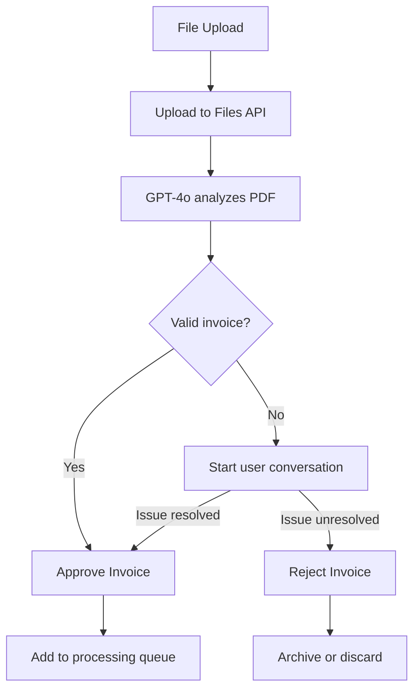

# Scan Approval Processor Design

## Overview

The scan approval processor uses GPT-4o to analyze invoice scans and determine if they contain required elements:

1. A scanned invoice (PDF) is uploaded via the file-upload endpoint
2. The scan is processed using OpenAI's Files API and GPT-4o
3. Based on the analysis, the invoice is either automatically approved or a conversation with the user is initiated

## Implementation Architecture

### Files API Approach

We use OpenAI's Files API to handle PDFs efficiently, focusing on the upper half of invoices where key information appears:

```javascript
import fs from "fs";
import OpenAI from "openai";
const client = new OpenAI();

const file = await client.files.create({
    file: fs.createReadStream("draconomicon.pdf"),
    purpose: "user_data",
});

const response = await client.responses.create({
    model: "gpt-4.1",
    input: [
        {
            role: "user",
            content: [
                {
                    type: "input_file",
                    file_id: file.id,
                },
                {
                    type: "input_text",
                    text: "What is the first dragon in the book?",
                },
            ],
        },
    ],
});

console.log(response.output_text);
```

### Image Processing Optimization

For optimal validation accuracy:

1. **Focus on Upper Half**
   - Key validation elements (invoice number, supplier name, date, line item headers) are typically in the upper portion
   - Ask GPT-4o to specifically examine this area for better accuracy

2. **How OpenAI Processes Images**
   - Images are scaled to fit within 2048×2048 square
   - Shortest side is scaled to 768px
   - Image is divided into 512×512 pixel tiles (each tile costs 170 tokens)
   - Base cost of 85 tokens added

## Required Invoice Elements

For automatic approval, we validate the presence of:
- Invoice number
- Supplier name
- Date
- Line items with appropriate column structure (item name, barcode if available, quantity)

We check for the presence and structure of these elements, not their specific content. Actual data extraction is handled by a dedicated Azure OCR service in a later pipeline stage.

## Issue Resolution Approach

For invoices with validation issues, we use a conversation-based resolution approach:

1. **Maintain File Reference in Conversation**
   - Keep the file_id in the conversation history throughout resolution
   - Ensures the model always has full context of the invoice
   - Provides consistent, accurate responses about the document

2. **Multi-turn Conversation Flow**
   - Initial message: Describe specific validation issues
   - User responses: Clarifications or corrections
   - Resolution: Approval decision based on conversation

3. **Context Management**
   - Remove file reference from history after validation completes
   - Prevents unnecessary token usage in future unrelated conversations
   - Creates clean separation between different invoice validations

This approach optimizes for accuracy during issue resolution while remaining cost-effective. Even with multiple interactions per problematic invoice (~10 exchanges), the total cost remains minimal (approximately $0.025-0.03 per issue resolution).

## Workflow



## Cost Considerations

- **PDF Processing**: ~$0.001-0.002 per invoice validation when focusing on upper half
- **Follow-up Messages**: Text-only messages are extremely economical, even with file reference (~$0.0025 per message)
- **Multiple Interactions**: Even 10 interactions for problem resolution costs only ~$0.025-0.03 total
- **File Storage**: Files can be deleted after processing is complete

## Implementation Phases

1. **Basic Setup**: Files API integration, GPT-4o validation
2. **Interactive Resolution**: Conversation handling for issue resolution
3. **Advanced Features**: Error handling, analytics, performance optimization 