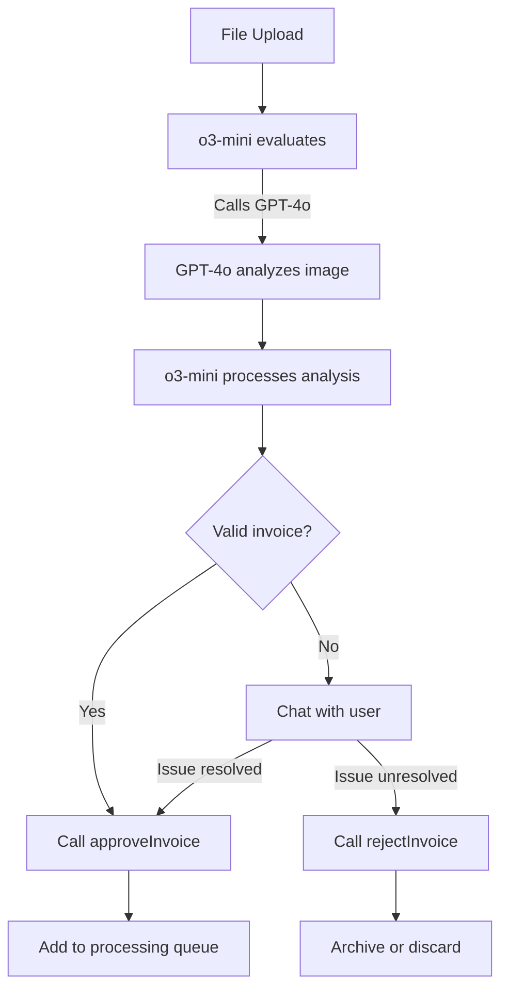

# Scan Approval Processor Design

## Overview

The scan approval processor uses a two-model approach to efficiently analyze and validate invoice scans:

1. A scanned invoice is uploaded via the file-upload endpoint
2. o3-mini serves as the "brain" for conversation flow and decision-making
3. GPT-4o is used exclusively for image analysis via function calls
4. Based on the analysis, the invoice is either automatically approved or a conversation with the user is initiated

## Two-Model Architecture

### Why Two Models?

Using o3-mini as the controller and GPT-4o only for vision tasks provides several advantages:

1. **Cost Efficiency**: GPT-4o is only invoked when image analysis is needed
2. **Lower Token Usage**: Image data is kept out of conversation history
3. **Specialized Roles**: Each model does what it does best
4. **Improved Performance**: Simpler, more focused interactions

### Required Invoice Elements

For automatic approval, we check for:
- Invoice number
- Supplier name
- Date
- Line items with quantities

Line item details will be extracted by our dedicated OCR service in a later pipeline stage.

## Implementation Architecture

```typescript
// Main handler - o3-mini as controller with GPT-4o for vision
async function handleScanApprovalProcess(userMessage, context) {
  // o3-mini handles conversation flow and decisions
  const response = await callO3Mini(userMessage, context);
  
  // o3-mini can request image analysis when needed
  if (response.needsImageAnalysis) {
    // GPT-4o only processes the image, keeping image data out of conversation
    const imageAnalysis = await callGPT4oVision(response.query, context.filePath);
    return await continueWithAnalysisResult(imageAnalysis, context);
  }
  
  // Handle approvals/rejections via function calls
  if (response.decision) {
    if (response.decision === "approve") {
      await onScanApproved(context.filePath, response.metadata);
      return { status: "approved" };
    } else if (response.decision === "reject") {
      await onScanRejected(context.filePath, response.reason);
      return { status: "rejected" };
    }
  }
  
  return { status: "continue", message: response.reply };
}
```

## Function Tools for o3-mini

```typescript
const functions = [
  {
    name: "analyzeInvoiceImage",
    description: "Analyze the invoice image to validate required information",
    parameters: {
      type: "object",
      properties: {
        query: {
          type: "string", 
          description: "What to look for in the image"
        }
      },
      required: ["query"]
    }
  },
  {
    name: "approveInvoice",
    description: "Approve the invoice when all required elements are present",
    parameters: {
      type: "object",
      properties: {
        invoiceNumber: { type: "string" },
        supplierName: { type: "string" },
        date: { type: "string" },
        reason: { type: "string" }
      },
      required: ["invoiceNumber", "supplierName", "date", "reason"]
    }
  },
  {
    name: "rejectInvoice",
    description: "Reject the invoice when required elements are missing",
    parameters: {
      type: "object",
      properties: {
        reason: { type: "string" },
        missingElements: { type: "array", items: { type: "string" } }
      },
      required: ["reason", "missingElements"]
    }
  }
]
```

## Workflow



## Key Points for Implementation

1. **Keep Image Data Separate**:
   - Image data is never stored in conversation history
   - Base64 image is loaded only when needed for GPT-4o analysis

2. **Function-Based Decisions**:
   - o3-mini explicitly calls approval/rejection functions
   - No need to parse responses for decision logic

3. **Minimal Metadata**:
   - Only extract invoice number, supplier name, and date
   - Leave detailed line item extraction to the OCR pipeline

4. **WhatsApp Integration**:
   - User conversation happens via WhatsApp for rejected or unclear scans
   - o3-mini can call image analysis again during conversation if needed

## Cost Considerations

- o3-mini text processing: Very low cost per message
- GPT-4o image analysis: ~$0.01-0.03 per invoice
- Using the two-model approach reduces costs by ~80% compared to a pure GPT-4o solution

## Implementation Phases

1. **Basic Setup**: o3-mini controller, GPT-4o function calls, auto-approval
2. **Interactive Resolution**: WhatsApp integration, conversation handling
3. **Advanced Features**: Caching, learning, analytics 